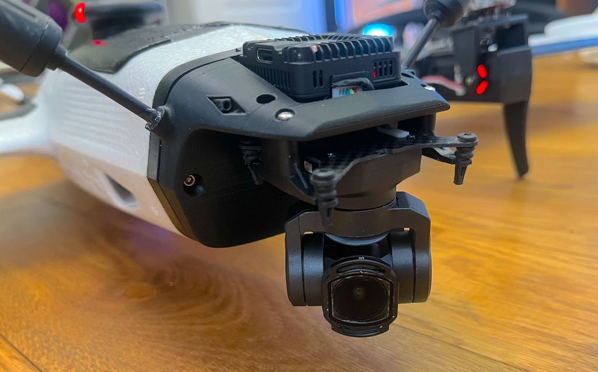

# gimbal_poi_tracker.lua

Script Lua pour ArduPlane 4.7 — Verrouillage et suivi automatique d'un point d'intérêt (POI) avec le gimbal CADDX.

**Auteur :** Alexis Artus (2026)

## Démonstration

[](https://youtu.be/RbMBZhsmI9k)

---

## Matériel requis

| Composant | Paramètre ArduPlane |
|---|---|
| Gimbal CADDX sur port série (ex : SERIAL4) | `SERIAL4_PROTOCOL = 8`, `SERIAL4_BAUD = 115200` |
| Type de mount | `MNT1_TYPE = 13` (CADDX) |
| RC7 — **switch 3 positions** | Activation tracking + contrôle verrouillage gimbal |
| RC8 — switch 3 positions | Mode gimbal (neutre / normal) |

---

## Paramètres utilisateur (en-tête du script)

| Paramètre | Défaut | Description |
|---|---|---|
| `RC_CHANNEL` | 7 | Canal RC d'activation du tracking (3 positions) |
| `RC_HIGH_THRESHOLD` | 1700 µs | Au-dessus : tracking ON + ROI verrouillé sur la cible |
| `RC_LOW_THRESHOLD` | 1300 µs | En dessous : tracking OFF (zone MID : 1300–1700 µs) |
| `RC_GIMBAL_MODE` | 8 | Canal RC de contrôle du mode gimbal |
| `RC_GIMBAL_LOW` | 1300 µs | En dessous : gimbal neutre (droit devant) |
| `UPDATE_HZ` | 10 | Fréquence de la boucle (Hz) |
| `MAX_TARGET_DIST_M` | 3000 m | Distance cible maximale. Si la distance calculée dépasse cette valeur, la cible est **plafonnée** à cette distance dans le même azimut (pas de refus). |
| `MIN_PITCH_DEG` | −5.0° | Angle de dépression minimum du gimbal. L'activation est **refusée** si le gimbal est moins incliné (ex. −3° est trop plat par rapport à −5°). En dessous de −5°, le rayon de visée est trop horizontal : une erreur angulaire de ±0.5° entraîne ~26 m d'erreur de position à 100 m AGL. |
| `GIMBAL_OFFSET_X` | 0.20 m | Position du gimbal en avant du CG (repère corps) |
| `GIMBAL_OFFSET_Y` | 0.00 m | Position du gimbal à droite du CG (repère corps) |
| `GROUND_TEST_MODE` | false | Mettre à `true` pour simuler l'altitude au sol |
| `GROUND_TEST_ALT_M` | 100 m | Hauteur AGL simulée quand `GROUND_TEST_MODE = true` |
| `POI_ORBIT_RAD_M` | depuis `WP_LOITER_RAD` | Rayon d'arrivée : notification GCS envoyée une fois à l'entrée dans ce cercle |
| `POI_PROGRESS_STEP_M` | 50 m | Intervalle de progression : mise à jour GCS tous les N mètres rapprochés |

---

## RC7 — Switch 3 positions

RC7 est le contrôle principal de tout le script.

| Position RC7 | Comportement |
|---|---|
| **LOW** (< 1300 µs) | Tracking OFF — retour au mode de vol précédent, gimbal libre |
| **MID** (1300–1700 µs) | Tracking ON — GUIDED maintenu, gimbal libre (RC_TARGETING, sticks actifs) |
| **HIGH** (> 1700 µs) | Tracking ON — GUIDED + ROI verrouillé sur la cible, pas d'override manuel possible |

**MID et HIGH activent tous les deux le tracking** sur un flanc montant depuis LOW. La position GPS de la cible est calculée une seule fois à partir des angles courants du gimbal et mémorisée. Les transitions MID↔HIGH suivantes basculent uniquement le verrouillage du gimbal, sans recalculer la cible.

---

## RC8 — Override du mode gimbal

RC8 est prioritaire sur le verrouillage ROI.

| Position RC8 | Comportement |
|---|---|
| LOW (< 1300 µs) | Gimbal en mode NEUTRAL — pointe droit devant, quelle que soit la position de RC7 |
| MIDDLE ou HIGH | Comportement normal — ROI actif si RC7 HIGH |

---

## Fonctionnement général

```
┌─────────────────────────────────────────────────────┐
│  Boucle 10 Hz                                       │
│                                                     │
│  RC8 < 1300 µs ?  →  gimbal NEUTRAL (mode 1)       │
│                                                     │
│  RC7 LOW → MID  : activation tracking, gimbal libre │
│  RC7 LOW → HIGH : activation tracking, ROI verrouillé│
│  RC7 LOW        : désactivation tracking            │
│                                                     │
│  Si tracking actif :                                │
│    RC7 MID → HIGH : ROI verrouillé                  │
│    RC7 HIGH → MID : gimbal libre (RC_TARGETING)     │
│    → Renvoi waypoint GUIDED à chaque cycle          │
│    → Notifications de progression vers la cible     │
└─────────────────────────────────────────────────────┘
```

---

## Activation du tracking (RC7 MID ou HIGH depuis LOW)

À l'activation, le script effectue les opérations suivantes **une seule fois** :

### 1. Lecture des angles du gimbal

```lua
mount:get_attitude_euler(0)  →  (roll_bf, pitch_bf, yaw_bf)
```

Le driver CADDX d'ArduPilot ne rapporte pas l'attitude mesurée du gimbal. `get_attitude_euler()` retourne les **angles cibles envoyés au gimbal**, déjà exprimés en **repère monde** (pitch relatif à l'horizon, pas au corps de l'avion). Par conséquent, `pitch_bf` est déjà un angle de dépression dans le référentiel terrestre — aucune correction d'attitude avion n'est appliquée.

Le yaw est rapporté en repère corps et converti en cap géographique absolu :

```
yaw_géo = (cap_avion + yaw_body_frame) % 360
```

### 2. Garde sur l'angle de dépression

L'activation est refusée si l'élévation du gimbal est au-dessus de `MIN_PITCH_DEG` :

```
si pitch_world > MIN_PITCH_DEG  →  abandon, message GCS avec l'angle mesuré
```

À faible angle de dépression, l'erreur de position croît rapidement :

| AGL | Dépression | Portée calculée | Bruit ±0.5° → erreur position |
|---|---|---|---|
| 100 m | −5° | ~1145 m | ±20 m |
| 100 m | −10° | ~567 m | ±5 m |
| 100 m | −20° | ~275 m | ±1.5 m |
| 100 m | −45° | 100 m | ±0.5 m |

### 3. Correction du bras de levier gimbal

La position AHRS est celle du CG de l'avion. Le gimbal est décalé de `(GIMBAL_OFFSET_X, GIMBAL_OFFSET_Y)` en repère corps. Ce décalage est projeté horizontalement dans le plan au sol en utilisant le cap de l'avion :

```
lever_north = GIMBAL_OFFSET_X · cos(cap) − GIMBAL_OFFSET_Y · sin(cap)
lever_east  = GIMBAL_OFFSET_X · sin(cap) + GIMBAL_OFFSET_Y · cos(cap)
```

L'origine du rayon de visée est décalée de ce montant avant le calcul de la position GPS de la cible.

> **Pourquoi pas de correction verticale ?**  
> Avec un décalage de 0.20 m vers l'avant et jusqu'à 15° de pitch avion, l'erreur
> verticale sur la cible est < 10 cm — bien en dessous du bruit GPS (±2–5 m) et du
> bruit angulaire du gimbal (~26 m à −20°, 100 m AGL). Une matrice de rotation
> complète était utilisée auparavant ; elle a été supprimée car elle ajoutait de la
> complexité sans bénéfice mesurable.

### 4. Calcul de la position GPS de la cible

#### Vue de profil — distance horizontale

```
                 avion
                   *
                  /|
                 / |
    rayon       /  |  hauteur_AGL
    visuel      /  |  = alt_effective_MSL − alt_home_MSL
   du gimbal   /   |
              / θ  |
             /_____|___________
           cible          sol (home alt)

  θ  = |pitch_world|   (angle de dépression, toujours > 0)

  dist_horiz = hauteur_AGL / tan(θ)
```

Si `dist_horiz > MAX_TARGET_DIST_M`, la valeur est **plafonnée** à `MAX_TARGET_DIST_M` et un avertissement GCS est envoyé. L'activation se poursuit quand même.

#### Vue de dessus — décomposition Nord/Est

```
              Nord
               ↑
               |
    avion      *─ ─ ─ ─ ─ ─ ─ ─ ─ ─ ─→ Est
               |╲
               |  ╲  yaw_géo = 135° (Sud-Est)
               |    ╲  dist_horiz = 227 m
   delta_N     |      ╲
   (négatif    |        ╲
   = vers Sud) ↓          ╲
               P ─ ─ ─ ─ ─ * cible
                  delta_E
                  (positif = vers Est)

  delta_N = 227 × cos(135°) = −161 m
  delta_E = 227 × sin(135°) = +161 m
```

#### Conversion mètres → degrés GPS

```
  lat_cible = lat_gimbal + delta_N / 111320
  lon_cible = lon_gimbal + delta_E / (111320 × cos(lat_gimbal))
```

**L'altitude de la cible est fixée à l'altitude home.** Cela garantit qu'ArduPlane calcule le même angle de dépression que le gimbal lors de l'envoi du ROI — pas de saut de la caméra à l'activation.

### 5. Création des deux objets Location

| Objet | Altitude | Usage |
|---|---|---|
| `roi_loc` | `home_alt` MSL | ROI gimbal — angle de dépression correct |
| `target_loc` | altitude MSL effective de l'avion | Waypoint GUIDED — l'avion maintient son altitude |

### 6. Séquence d'activation

```
si RC7 HIGH :
  mount:set_roi_target()        → gimbal verrouillé sur la cible immédiatement
si RC7 MID :
  mount:set_mode(RC_TARGETING)  → gimbal libre, répond aux sticks
vehicle:set_mode(15)            → passage en GUIDED
vehicle:set_target_location()   → envoi du waypoint
```

### 7. Messages GCS à l'activation

```
POI: GROUND TEST MODE — simulated alt=100m AGL   (uniquement si GROUND_TEST_MODE = true)
POI dbg1: plane=XXXm home=XXXm agl=XXXm [TEST]
POI dbg2: pitch_bf=XX.X plane_p=XX.X plane_r=XX.X pitch_w=XX.X yaw_bf=XX.X dist=XXXm
POI dbg3: lev_n=X.XXXm lev_e=X.XXXm
POI dbg4: target=XX.XXXXXXX,XX.XXXXXXX alt_home=XXXm
POI locked dist:XXXm pos:Xh                ← si RC7 HIGH
POI guided (gimbal free) dist:XXXm pos:Xh  ← si RC7 MID

POI: gimbal too shallow (−3.2° > −5.0°), aborted   ← si angle trop faible
POI: shallow angle, target clamped to 3000m          ← si distance plafonnée
```

La **position horloge** indique la direction de la cible par rapport au cap de l'avion (`12h` = devant, `6h` = derrière, `3h` = droite, `9h` = gauche).

---

## Boucle active (tracking en cours)

À chaque cycle (100 ms) :

### Gestion du verrouillage ROI

```
RC7 MID → HIGH :
  roi_locked = true
  mount:set_roi_target()       → ROI engagé
  GCS : "POI: ROI locked"

RC7 HIGH → MID :
  roi_locked = false
  mount:set_mode(RC_TARGETING) → gimbal répond aux sticks
  GCS : "POI: gimbal free (RC7 mid)"

Si roi_locked et RC8 non LOW :
  mount:set_roi_target()       → ROI rafraîchi à chaque cycle
```

### Notifications de progression

À chaque cycle, tant que l'avion n'a pas atteint le rayon d'orbite :

```
distance calculée → arrondie au palier de 50 m inférieur

Si palier inférieur au dernier notifié :
  GCS : "POI: XXXm to target"    (ex. 600m, 550m, 500m, …)

Si distance ≤ POI_ORBIT_RAD_M :
  GCS : "POI: orbiting target (dist=XXXm)"   ← envoyé une seule fois
```

### Maintien de l'orbite GUIDED

```lua
vehicle:set_target_location(last_target_loc)
```

Le waypoint est renvoyé à chaque cycle. ArduPlane orbite autour du point cible en GUIDED de façon stable et précise.

---

## Désactivation (RC7 LOW)

```
active = false
mount → RC_TARGETING (gimbal répond aux sticks)
vehicle → mode précédent (sauvegardé à l'activation)
GCS : "POI off, mode X"
```

---

## Notes techniques

### Pourquoi le pitch CADDX ne nécessite pas de correction d'attitude

Le driver CADDX d'ArduPilot (`AP_Mount_CADDX`) rapporte les **angles cibles envoyés au gimbal**, pas les angles mesurés. Ces angles sont déjà exprimés en repère terrestre (pitch relatif à l'horizon). Appliquer une correction pitch/roll avion par-dessus double-corrigerait l'angle et provoquerait un dépassement en vol.

### Pourquoi home altitude comme référence ?

Utiliser l'altitude home garantit que `calc_target_gps()` et ArduPlane utilisent la **même référence** pour calculer l'angle de dépression du ROI. Si une autre référence est utilisée (ex : terrain), ArduPlane corrige l'angle du gimbal à l'activation → saut visible sur la caméra.

### Pourquoi GUIDED et non LOITER ?

Le mode LOITER centre l'orbite sur la **position courante de l'avion** au moment de son activation, pas sur le waypoint transmis. GUIDED avec `set_target_location()` renvoyé en continu maintient l'avion précisément sur la cible calculée.

---

## Diagramme d'état

```
                    ┌──────────┐
         RC7 LOW    │  INACTIF │
    ┌───────────────│          │◄──────────────────────┐
    │               └──────────┘                       │
    │        RC7 LOW→MID │ RC7 LOW→HIGH                │ RC7 LOW
    │       gimbal libre │ ROI verrouillé              │
    │                    ▼                             │
    │               ┌───────────────────────────┐      │
    │               │  ACTIF (GUIDED)           │      │
    │               │                           │      │
    │               │  RC7 HIGH → roi_locked    │      │
    │               │  RC7 MID  → gimbal libre  │      │
    │               │                           │      │
    │               │  RC8 LOW prioritaire      │──────┘
    │               └───────────────────────────┘
    │
    └── sur RC7 LOW : restaure prev_mode, gimbal RC_TARGETING
```
